# PodWiki 网页细节审查

日期：2026-08-07

## 审查范围

- 左上角 PodWiki 品牌入口与根路由
- 浏览器 Tab favicon
- 节目主页在桌面端与移动端的布局
- 阅读页章节导航、页面导航和阅读设置
- 搜索加载、结果与焦点恢复
- 404 页面及基础键盘可访问性

## 结论

核心流程已经修复并通过回归。左上角 PodWiki 现在直接进入 `/shows`；根路径 `/` 同样重定向到节目主页。浏览器 Tab 新增 64×64 PNG favicon，网页正文没有新增 Logo。

桌面端、平板端和移动端未发现横向溢出。阅读页不再用静态状态误导用户当前所在章节，搜索过程有可见的加载反馈，阅读设置只在适用页面显示。

## 流程与证据

### 1. 品牌入口

修复前，打开根路径或点击左上角 PodWiki 会进入固定单集，而不是节目主页。

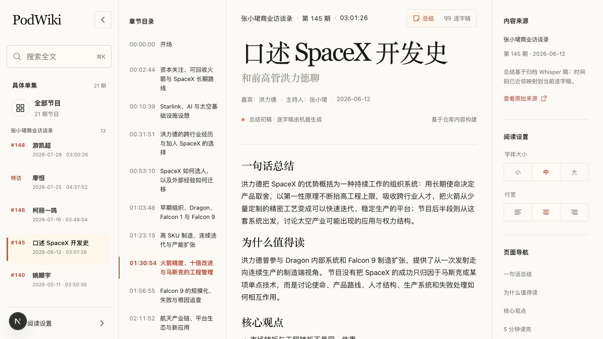

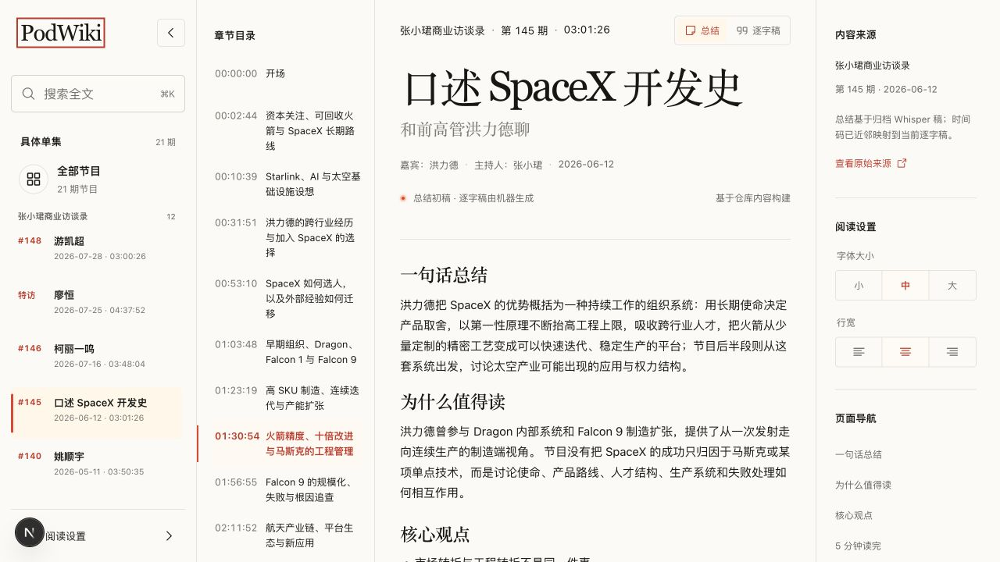

修复后，品牌入口直接指向 `/shows`；移动端点击后会同时关闭侧栏。

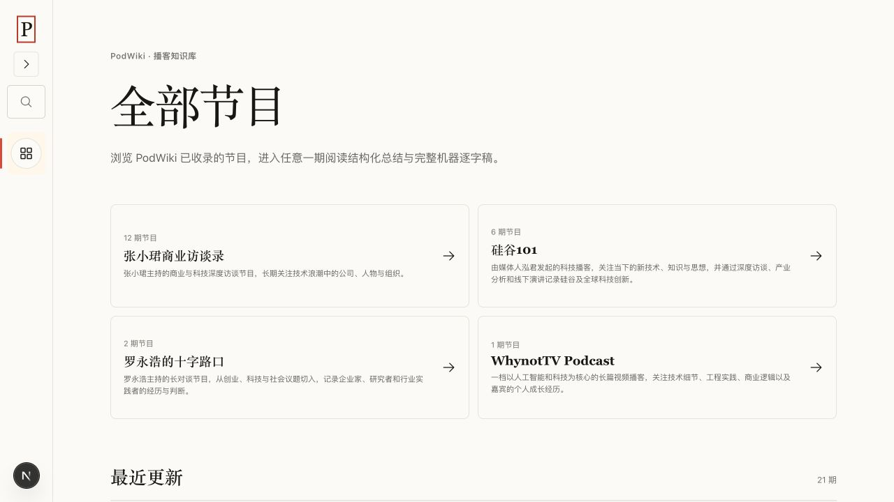

### 2. 节目主页布局

桌面节目卡由不平衡的三列尾行布局调整为两列，四个节目形成完整的 2×2 网格。

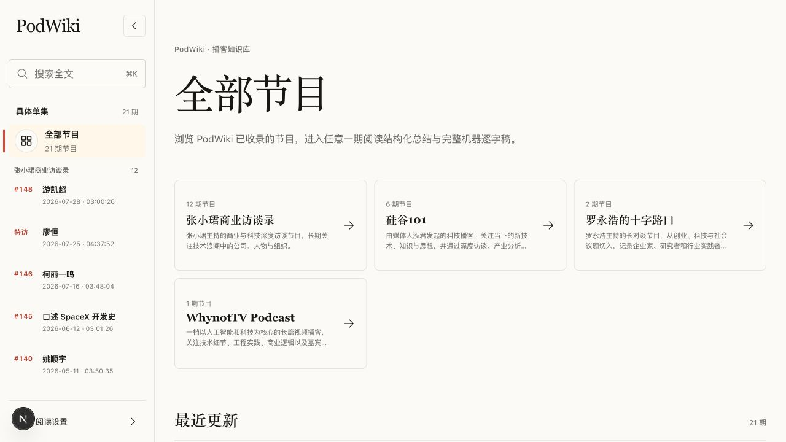

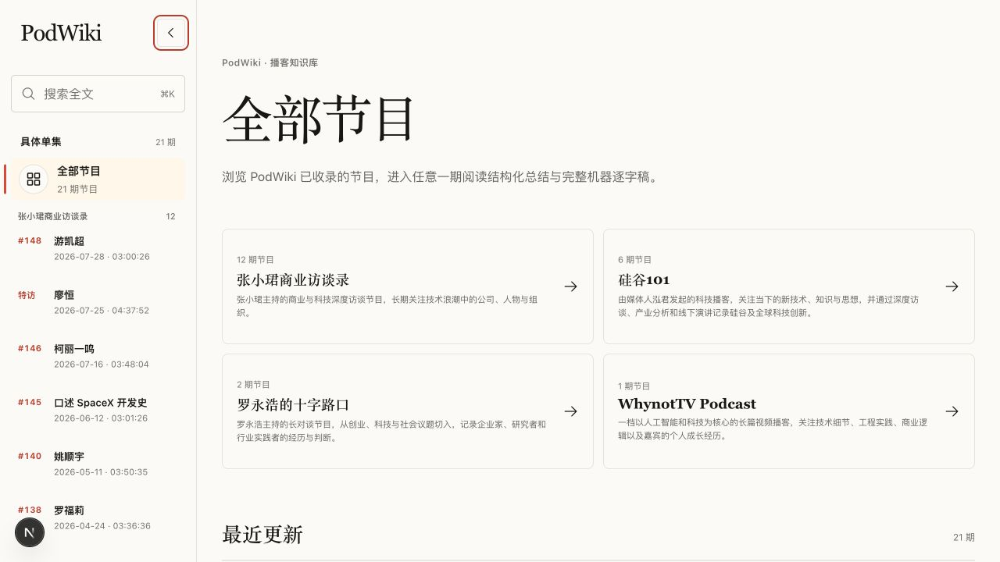

### 3. 移动端导航

390×844 视口下，节目主页和抽屉导航均无横向溢出；点击品牌入口后抽屉关闭，页面滚动状态恢复。

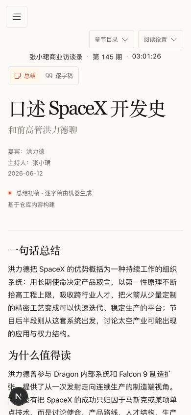

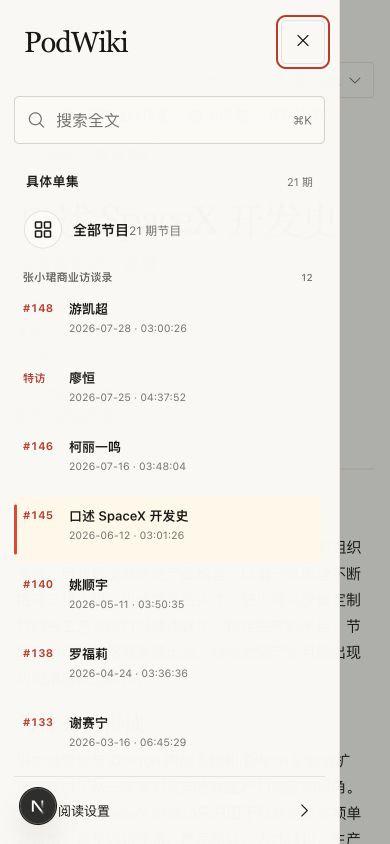

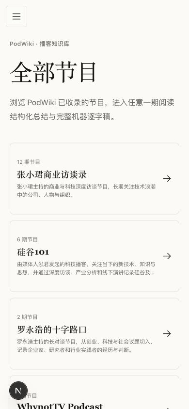

### 4. 阅读页

移除了无法随滚动位置变化的伪“当前章节”和摘要页伪激活状态；补充了链接悬停反馈、可见滚动条与更清晰的文字对比度。阅读设置在窄屏时通过顶部工具入口访问，两个移动工具面板互斥展开。

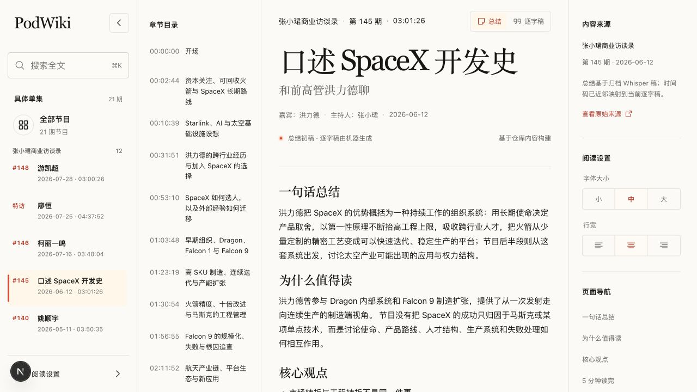

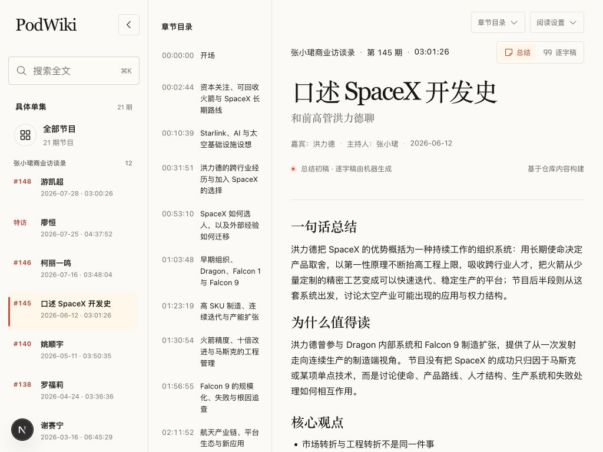

### 5. 搜索

搜索请求期间显示“正在搜索…”；结果出现后可继续使用键盘选择，关闭弹窗时焦点返回搜索按钮。

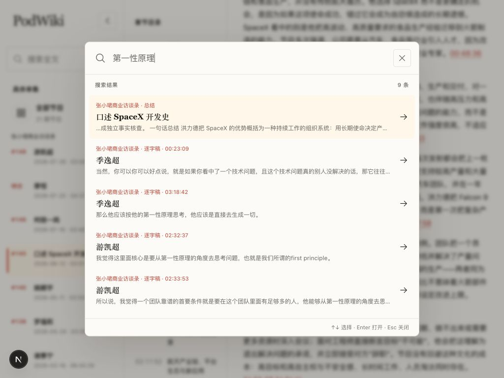

### 6. 浏览器 Tab favicon

favicon 使用项目现有的暖色与红色视觉语言，在 64px 和 16px 下均保持可辨识；它只出现在浏览器 Tab，不出现在网页正文。

### 7. 阅读导航二次调整

总结页不再展示属于逐字稿的章节栏，右侧页面导航中无反馈的“章节目录”入口也已移除。总结与逐字稿切换栏成为阅读区顶部的固定工具栏，页面滚动后仍可使用。

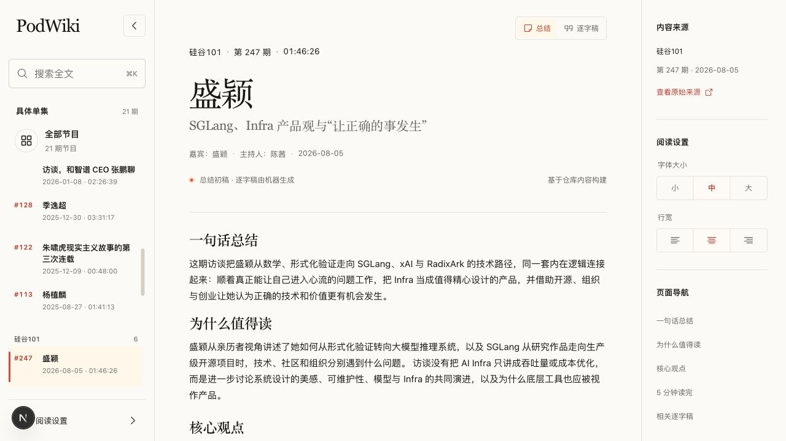

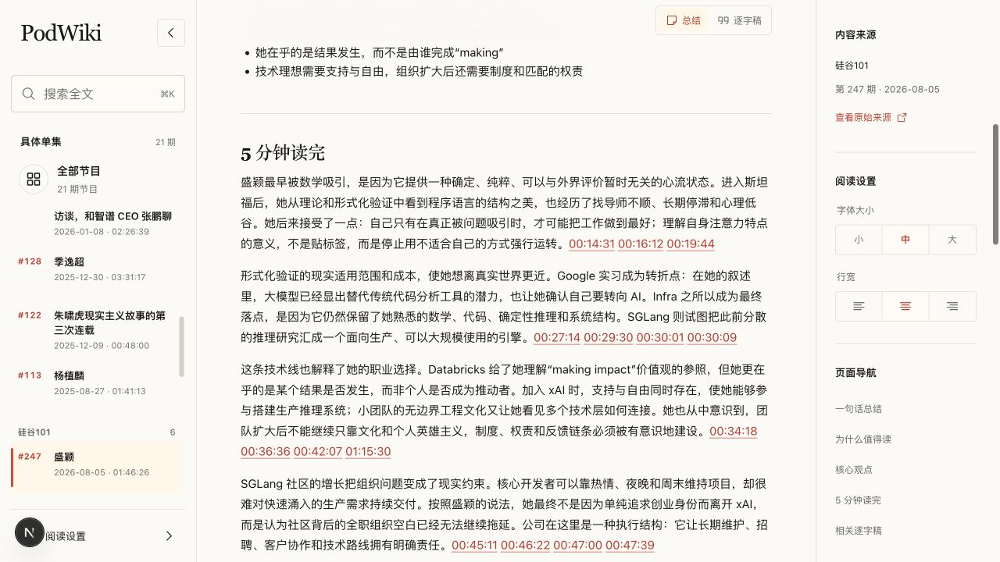

逐字稿桌面端保留左侧章节栏；移动端隐藏左栏并提供章节下拉入口。下拉层位于切换栏和按钮下方，不会遮挡视图切换。

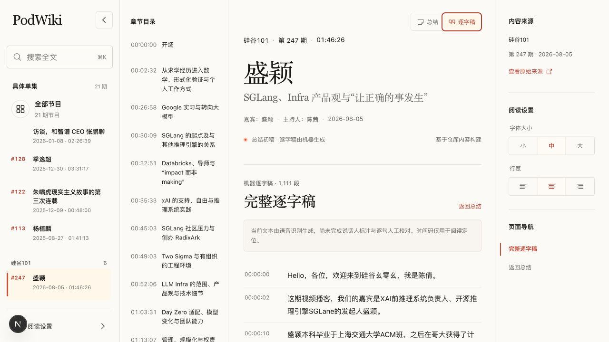

## 已实施改进

- 根路由重定向至 `/shows`，品牌入口直接链接至 `/shows`
- 移动端点击品牌入口时关闭导航抽屉
- 新增 Next.js App Router favicon
- 主页节目卡调整为平衡的两列布局
- 移除误导性的静态章节和摘要导航激活状态
- 恢复浏览器原生页面滚动条
- 改善副标题、占位文本和小号元信息的可读性
- 补充阅读页链接悬停反馈
- 阅读设置仅在单集阅读页显示
- 移动端章节目录与阅读设置互斥展开
- 章节目录只在逐字稿视图出现，桌面与移动端采用各自合适的入口
- 总结与逐字稿切换栏在滚动时保持可见
- 长逐字稿章节跳转会在懒渲染布局稳定后重新校准落点
- 删除右侧无反馈的“章节目录”链接和内部核查说明
- 搜索增加可见加载状态
- 404 主内容增加程序化焦点目标
- Vitest 同时覆盖 `.test.ts` 与 `.test.tsx`

## 验证结果

- `npm run check` 通过
  - ESLint 通过
  - TypeScript 类型检查通过
  - Vitest：3 个测试文件、15 项测试全部通过
  - Next.js 生产构建通过，生成 37 个页面，包含 `/icon`
- `git diff --check` 通过
- 浏览器回归覆盖 1280×720、1024×768、390×844
- 已检查主页入口、移动导航、阅读设置、搜索加载与焦点恢复
- 检查过程中未观察到浏览器 warning 或 error

## 剩余限制

- 当前是人工真实浏览器回归，尚未固化为 Playwright 端到端测试
- 尚未接入 axe 等自动化无障碍扫描，因此不能据此宣称完整 WCAG 合规
- `details[name]` 的互斥行为在不支持该属性的旧浏览器中会自然降级为允许同时展开
